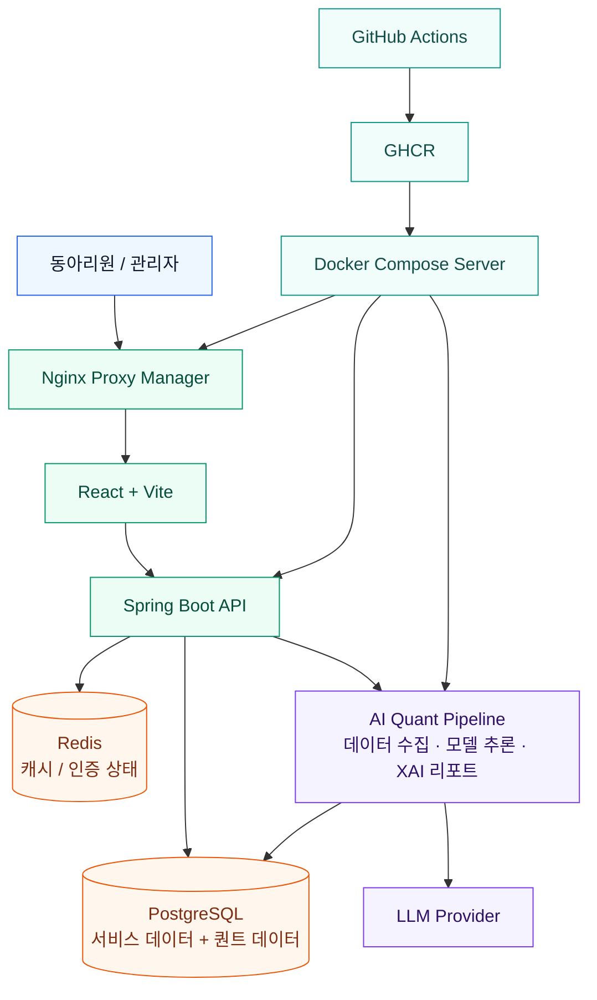

<div align="center">


# 세종투자연구회 웹사이트 프로젝트

이 프로젝트는 동아리 운영에 필요한 웹 서비스와 금융 데이터 기반 AI/퀀트 시스템을 하나의 제품으로 통합한 프로젝트입니다.

기존 네이버 카페와 수기 출석 관리를 대체하는 내부 서비스에서 시작해, 게시판, 출석, 포인트, 모의 트레이딩, 백테스팅, 관리자 기능, AI 퀀트봇까지 확장하고 있습니다. 실제 동아리 구성원이 사용하는 서비스를 운영하며, 기능 개발, 리팩토링, 성능 개선, 배포, 모니터링, 코드 리뷰 경험을 함께 쌓는 것을 목표로 합니다.

<br />


</div>

## 핵심 가치

- 실제 사용자 기반의 동아리 운영 플랫폼
- 금융 데이터를 활용한 모의 투자 및 백테스팅 경험
- Spring Boot, React, PostgreSQL, Redis, Docker 기반의 운영형 웹 서비스
- AI 모델, 데이터 파이프라인, XAI 리포트를 포함한 퀀트 트레이딩 실험 환경
- CI/CD, 테스트, 문서화, 코드 리뷰를 통한 지속 가능한 팀 개발

## 주요 기능

### 동아리 운영 서비스

| 기능 | 설명 |
| --- | --- |
| 게시판 | 팀별 게시판, 게시글/댓글, 파일 첨부, 리치 텍스트 에디터를 제공 |
| 공개 페이지 관리 | 대외 소개 페이지, 월간 리포트, 포트폴리오 게시물을 관리 |
| 출석 체크 | QR 기반 출석 세션과 회차 관리로 기존 수기 출석 방식을 대체 |
| 포인트 시스템 | 출석, 활동, 이벤트 등에 따라 포인트를 지급하고 이력을 관리 |
| 마이페이지 | 개인정보, 출석 현황, 활동 내역, 포인트 내역을 확인 |
| 관리자 기능 | 회원 승인, 회원 관리, 엑셀 업로드, 피드백 관리, 활동 대시보드 제공 |

### 금융 서비스

| 기능 | 설명 |
| --- | --- |
| 모의 트레이딩 게임 | 주가 방향을 예측하는 미니 게임으로 주식에 대한 접근성을 높임 |
| 백테스팅 툴 | 기술적 지표와 매매 조건을 조합해 투자 전략을 검증 |
| 전략 템플릿 | 백테스트 조건을 템플릿으로 저장하고 재사용 |
| 자산 관리 연동 | 외부 증권 API 기반 계좌 평가 및 잔고 조회 기능을 실험 |
| 퀀트봇 대시보드 | AI 매매 결과, 포지션, 체결 로그, 투자 근거 리포트를 시각화 |

### AI/퀀트 시스템

| 기능 | 설명 |
| --- | --- |
| 데이터 수집 | 주가, 지표, 거시경제 데이터, 종목 메타데이터를 수집하고 정제 |
| 피처 엔지니어링 | 기술적 지표, 시장 폭 지표, 이벤트 피처 등 모델 입력 데이터를 생성 |
| 일일 트레이딩 루틴 | 스크리닝, 모델 추론, 포트폴리오 비중 산출, 주문 시뮬레이션, 정산을 자동화 |
| 주간 재학습 루틴 | DB 데이터를 parquet으로 추출하고 Kaggle 학습을 트리거한 뒤 모델 가중치를 배포 |
| XAI 리포트 | 매수/매도/보유 신호와 함께 LLM 기반 투자 근거 리포트를 생성 |

## 시스템 아키텍처



## 기술 스택

### Frontend

- React 19
- Vite
- React Router
- Axios
- Tiptap Editor
- Recharts
- CSS Modules
- QRCode React

### Backend

- Java 21
- Spring Boot 3.5
- Spring Web, WebFlux
- Spring Security, OAuth2 Client, JWT
- Spring Data JPA
- PostgreSQL
- Flyway
- Redis
- Quartz Scheduler
- Spring Boot Actuator, Spring Boot Admin
- Swagger/OpenAPI
- TA4J
- JUnit, Testcontainers, Mockito, AssertJ, JaCoCo

### AI

- Python
- Pandas, NumPy
- PyTorch, TensorFlow CPU
- scikit-learn
- yfinance, FinanceDataReader, FRED API
- Gemini, Groq, Ollama 연동 모듈
- Kaggle 기반 학습 파이프라인

### Infrastructure

- Docker, Docker Compose
- PostgreSQL 16
- Redis
- Nginx Proxy Manager
- GitHub Actions
- GitHub Container Registry

## 기술적 특징

### 운영 가능한 백엔드 구조

- 도메인별 패키지 분리: `attendance`, `board`, `backtest`, `betting`, `point`, `admin`, `stock`, `user`
- JWT, OAuth2, 이메일 인증을 포함한 인증/인가 시스템
- Flyway 기반 DB 마이그레이션
- Redis 기반 캐시 및 상태 관리
- Actuator와 Spring Boot Admin을 통한 운영 모니터링
- JaCoCo와 diff coverage를 활용한 테스트 품질 관리

### 실제 사용 흐름을 고려한 프론트엔드

- 보호 라우트와 관리자 라우트 분리
- 게시판, 출석, 백테스팅, 퀀트봇, 관리자 페이지 등 기능별 화면 구성
- Tiptap 기반 리치 텍스트 에디터
- Recharts 기반 금융/활동 데이터 시각화
- QR 출석 및 실시간 사용자 흐름을 고려한 UI

### AI/퀀트 파이프라인

- 일일 루틴: 종목 스크리닝 → 데이터 전처리 → 모델 추론 → 포트폴리오 비중 산출 → 주문 시뮬레이션 → 정산
- 주간 루틴: DB 추출 → Kaggle 데이터셋 업로드 → 모델 재학습 → 가중치 다운로드 → 서버 배포
- XAI 리포트를 통해 AI 매매 신호의 판단 근거를 사용자에게 제공
- AI 전용 테이블스페이스와 스키마를 분리해 대용량 금융 데이터를 관리

## 프로젝트 구조

```text
sisc-web
├── frontend/              # React/Vite 기반 웹 클라이언트
├── backend/               # Spring Boot API 서버
│   ├── src/main/java/...   # 도메인별 백엔드 코드
│   ├── src/test/java/...   # 단위/통합 테스트
│   └── docs/               # 백엔드 기능별 설계 및 리포트 문서
├── AI/                    # 데이터 수집, 모델 추론, XAI, 백테스트 파이프라인
│   ├── pipelines/          # daily/weekly 자동화 루틴
│   ├── modules/            # 수집, 분석, 피처, 스크리닝 모듈
│   ├── backtests/          # 백테스트 실행 및 평가 코드
│   └── scripts/            # 학습/배포/데이터셋 운영 스크립트
├── docs/                  # 팀 운영 및 인수인계 문서
├── schema.sql             # AI/퀀트 데이터베이스 스키마 참고 문서
├── docker-compose.yml     # 운영 서버 컨테이너 구성
└── .github/workflows/     # CI/CD 워크플로우
```

## 테스트와 품질 관리

```bash
cd backend
./gradlew test
./gradlew jacocoTestReport
```

- Pull Request에서 백엔드 변경이 감지되면 GitHub Actions가 테스트와 JaCoCo 리포트를 실행합니다.
- diff coverage 기준을 통해 새로 변경된 코드의 테스트 품질을 확인합니다.
- 주요 도메인에는 서비스/컨트롤러/동시성/외부 연동 테스트가 포함되어 있습니다.

## 배포

- 프론트엔드, 백엔드, AI 모듈은 GitHub Actions에서 Docker 이미지로 빌드됩니다.
- 이미지는 GitHub Container Registry에 업로드됩니다.
- 서버에서는 Docker Compose로 `web`, `api`, `db`, `redis`, `npm` 컨테이너를 운영합니다.
- Nginx Proxy Manager가 외부 요청을 각 컨테이너로 라우팅합니다.

## 팀

세종투자연구회 금융IT팀은 실제 서비스를 직접 만들고 운영하며, 금융과 소프트웨어를 연결하는 프로젝트 경험을 쌓는 것을 목표로 합니다.
