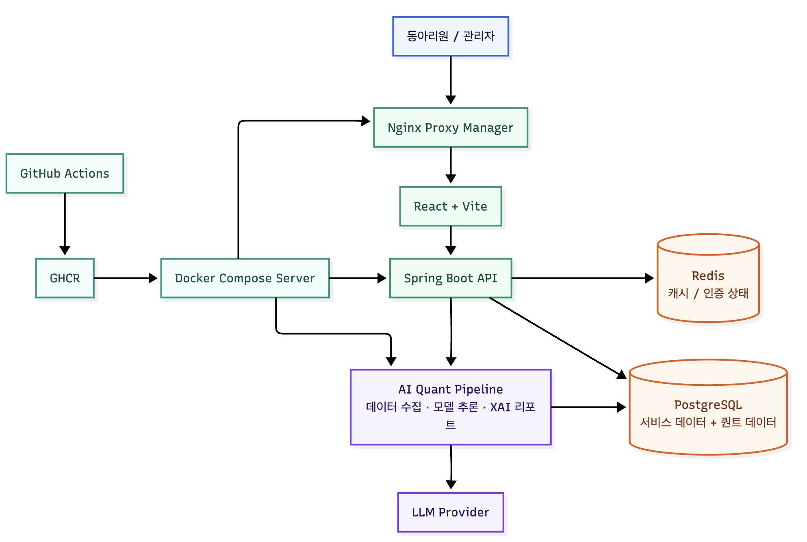

<div align="center">


# SISC Financial IT Team

### Finance × Software × AI

세종투자연구회(SISC)의 금융 IT팀은 동아리 구성원이 실제로 사용하는 서비스를 만들고, 금융 데이터와 소프트웨어를 연결하는 기능을 기획·개발합니다.

**Frontend · Backend · AI / Quant · Product / Planning**


</div>

## What We Build

하나의 웹서비스 안에서 동아리 운영과 금융 IT 실험을 함께 다룹니다. 기능을 나열하기보다, 서비스가 해결하는 문제를 세 가지 영역으로 구분했습니다.

| 영역 | 만드는 것 | 예시 |
| --- | --- | --- |
| **SISC Platform** | 구성원의 활동과 운영을 지원하는 내부 서비스 | 게시판·댓글·첨부파일, QR 출석, 포인트, 마이페이지, 회원 승인·관리, 운영 대시보드, 대외 소개·월간 리포트 |
| **Financial Service** | 금융을 더 가깝게 경험하고 전략을 검증하는 서비스 | 주가 방향 예측 게임, 백테스팅·전략 템플릿, 계좌 평가·잔고 조회 연동 |
| **AI / Quant** | 금융 데이터를 수집·분석하고 투자 판단을 실험하는 시스템 | 시장·거시경제·뉴스 데이터 수집, 피처 생성, 포트폴리오 산출·주문 시뮬레이션, XAI 리포트 |

## Product Preview


게시판, 출석 관리, 퀀트봇, 주식 베팅, 백테스팅과 마이페이지를 하나의 서비스 안에서 제공합니다.

## Our Team

이 저장소는 공식 파트 명칭을 별도로 정의하지 않습니다. 아래는 구현된 서비스와 코드 구조를 기준으로, 팀에서 함께 다룰 수 있는 역할 영역입니다.

| 영역 | 함께 다루는 일 |
| --- | --- |
| **Frontend** | React 기반 서비스 화면, 보호·관리자 라우트, 리치 텍스트 에디터, QR 흐름, 금융·활동 데이터 시각화 |
| **Backend** | 도메인 API, 인증·인가, PostgreSQL·Redis, DB 마이그레이션, 관리자 및 외부 연동 기능 |
| **AI / Quant** | 금융·뉴스 데이터 수집, 피처 엔지니어링, 모델 학습·추론, 백테스트와 XAI 리포트 파이프라인 |
| **Product / Planning** | 실제 구성원이 사용할 기능의 요구사항과 사용자 흐름을 구체화하고, 개발 영역 사이의 맥락을 연결 |

## How We Work

- 동아리 구성원이 사용하는 운영 서비스를 지속적으로 개선합니다.
- 하나의 저장소에서 Frontend, Backend, AI/Quant 코드를 함께 관리하며 기능을 연결합니다.
- GitHub Actions로 프론트엔드 빌드와 백엔드 테스트·변경분 커버리지를 확인하고, Docker 이미지 빌드·배포 워크플로우를 운영합니다.
- `CODEOWNERS`로 영역별 소유자를 두어 변경 범위를 관리합니다.

## Tech Stack

| 분야 | 핵심 기술 |
| --- | --- |
| **Frontend** | React 19, Vite, React Router, Recharts |
| **Backend** | Java 21, Spring Boot 3.5, PostgreSQL, Redis |
| **AI / Data** | Python, Pandas, PyTorch, TensorFlow, scikit-learn |
| **Infrastructure** | Docker Compose, GitHub Actions, GitHub Container Registry |

<details>
<summary><b>세부 라이브러리 및 운영 도구</b></summary>

<br />

- **Frontend:** Axios, Tiptap Editor, CSS Modules, QRCode React, React Markdown
- **Backend:** Spring Web·WebFlux·Security·OAuth2 Client, Spring Data JPA, Flyway, Quartz, Actuator, Spring Boot Admin, Swagger/OpenAPI, TA4J
- **AI / Data:** NumPy, yfinance, FinanceDataReader, FRED API, Gemini·Groq·Ollama 연동 모듈, Kaggle 학습 파이프라인
- **Quality:** JUnit, Testcontainers, Mockito, AssertJ, JaCoCo, diff coverage
- **Infrastructure:** Nginx Proxy Manager

</details>

## Architecture & Technical Details

### System Architecture



<details>
<summary><b>Backend</b></summary>

<br />

- `attendance`, `board`, `backtest`, `betting`, `point`, `admin`, `stock`, `user` 등 도메인 중심으로 구성합니다.
- JWT·OAuth2·이메일 인증을 포함한 인증·인가, Flyway 기반 DB 마이그레이션, Redis 기반 캐시·상태 관리를 사용합니다.
- Actuator·Spring Boot Admin으로 운영 상태를 확인하고, Swagger/OpenAPI로 API 문서를 제공합니다.

</details>

<details>
<summary><b>Frontend</b></summary>

<br />

- 일반 사용자와 관리자용 보호 라우트를 분리하고, 게시판·출석·백테스팅·퀀트봇·관리자 화면을 제공합니다.
- Tiptap 기반 리치 텍스트 에디터, Recharts 기반 데이터 시각화, QR 출석 흐름을 구현합니다.

</details>

<details>
<summary><b>AI / Quant Pipeline</b></summary>

<br />

- 일일 루틴은 종목 스크리닝, 모델 추론, 포트폴리오 비중 산출, 주문 시뮬레이션, 정산 및 선택적 XAI 리포트 생성을 수행합니다.
- 주간 루틴은 DB 데이터의 parquet 추출, Kaggle 업로드·학습 트리거, 가중치 다운로드와 서버 배포를 연결합니다.
- AI 전용 데이터베이스 스키마와 테이블스페이스를 분리해 금융 데이터를 관리합니다.

</details>

<details>
<summary><b>Quality & Deployment</b></summary>

<br />

- 백엔드 변경 Pull Request에서는 테스트와 JaCoCo 리포트를 실행하고, 변경분(diff) 커버리지 기준 70%를 확인합니다.
- 프론트엔드 변경 Pull Request에서는 Node.js 20 환경에서 의존성 설치와 프로덕션 빌드를 검증합니다.
- GitHub Actions는 Frontend·Backend·AI 이미지를 GitHub Container Registry에 빌드하고, Docker Compose 기반 운영 환경에 배포합니다.

</details>

## Repository Structure

```text
sisc-web/
├── frontend/              # React/Vite 웹 클라이언트
├── backend/               # Spring Boot API 서버와 테스트
├── AI/                    # 데이터 수집, 모델·백테스트, XAI, 자동화 파이프라인
├── .github/workflows/     # CI 및 Docker 이미지 빌드·배포 워크플로우
├── docker-compose.yml     # 운영 컨테이너 구성
├── schema.sql             # AI/퀀트 데이터베이스 스키마 참고
└── CODEOWNERS             # 경로별 코드 소유자
```

## Development Checks

자세한 실행 환경은 각 모듈의 설정과 환경 변수를 확인해야 합니다. 저장소에서 바로 확인할 수 있는 검증 명령은 다음과 같습니다.

```bash
# Backend test & JaCoCo report
cd backend
./gradlew test
./gradlew jacocoTestReport

# Frontend production build
cd ../frontend
npm ci
npm run build
```

## Join Us

금융과 소프트웨어를 연결하는 서비스를 직접 만들고, 실제 사용자의 흐름을 더 좋게 만들고 싶다면 SISC IT팀과 함께하세요.

**Frontend · Backend · AI / Quant · Product / Planning**

<!-- TODO: 모집 공고 또는 지원 링크가 확인되면 여기에 추가 -->
